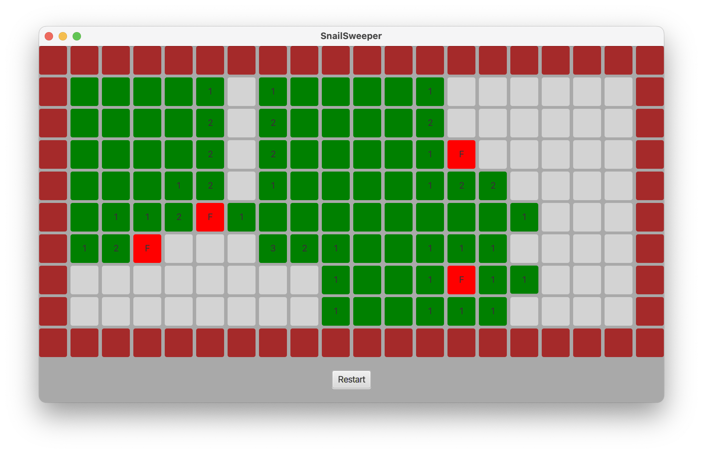

# Project & Training 1 (Block 3)


## Introduction

The goal of this Block 3 project is to develop a Java/Kotlin program to play the *Snailsweeper* game. Snailsweeper is a kid's version of the single-player game *Minesweeper* with the goal of locating snails (instead of landmines) in a field of grass in order to protect them from being crushed to death when stepping on them. To learn the concept and logic of the game, you can play Minesweeper online for example at https://minesweeperonline.com.

### Game Rules

The game is played on a board of size *n* (width) times *m* (height). Each cell of the board is in one of the following four *states*:
- Living snail (L)
- Crushed snail (C)
- Empty (E)
- Solid (S)

Additionally, the *visibility* of each cell is either:
- Hidden (H),
- Visible (V)
- Flagged (F).

In the beginning of the game, cells in state L, C, or G are hidden, whereas cells in state S are visible. The game board is always surrounded by a frame of visible solid cells. Other solid cells can be placed anywhere on the game board as obstacles. When the game board is constructed, living snails are placed in non-solid cells with probability *p*, where *p*=0.1 seems a reasonable value for obtaining a good game difficulty.

The only possible state change during a game is from L to C, which is caused by accidentally stepping on a living snail when unhiding the cell. In this case, the game is over. The goal of the game is to flag all living snails and to uncover all empty cells.

During the game, the player can choose between to following moves:
- *Unhide* a cell in state H
- *Flag* a hidden cell
- *Unflag* a flagged cell

The two moves *Flag* and *Unflag* can be merged into a single move *ToggleFlag*, which executes either *Flag* or *Unflag* (whichever is applicable).

If an empty cell is uncovered, then the game board displays the number of snails in the cell's direct neighborhood (the 8 surrounding cells). If this number is 0, then all adjacent (left/top/right/bottom) cells are automatically uncoverd recursively, which means that sometimes whole areas of cells are uncovered in a single step.

### Examples

Your implementation must consist of both a console app and an app with a graphical user interface (JavaFx/TornadoFX). Below you see some self-explanatory screenshots of how your solution could look like.

#### Console App

In the console app, moves are entered over the keyboard, for example "um3" means uncovering the cell at coordinates 'm' and '3' and "fu4" means flag/unflag the cell at coordinates 'u' and '4'.

```
WELCOME TO SNAILSWEEPER
u=Uncover, f=Flag/Unflag
abcdefghijklmnopqrstuvwxyz
##########################0
#XXXXXXXXXXXXXXXXXXXXXXXX#1
#XXXXXXXXXXXXXXXXXXXXXXXX#2
#XXXXXXXXXXXXXXXXXXXXXXXX#3
#XXXXXXXXXXXXXXXXXXXXXXXX#4
##########################5
L=4 / C=0 / F=0 / H=96
> um3
abcdefghijklmnopqrstuvwxyz
##########################0
#X1                      #1
#X1     111              #2
#11     1X1        1221  #3
#       1X1        1XX1  #4
##########################5
L=4 / C=0 / F=0 / H=6
> fu4
abcdefghijklmnopqrstuvwxyz
##########################0
#X1                      #1
#X1     111              #2
#11     1X1        1221  #3
#       1X1        1FX1  #4
##########################5
L=4 / C=0 / F=1 / H=5
> fv4
abcdefghijklmnopqrstuvwxyz
##########################0
#X1                      #1
#X1     111              #2
#11     1X1        1221  #3
#       1X1        1FF1  #4
##########################5
L=4 / C=0 / F=2 / H=4
> fj3
abcdefghijklmnopqrstuvwxyz
##########################0
#X1                      #1
#X1     111              #2
#11     1F1        1221  #3
#       1X1        1FF1  #4
##########################5
L=4 / C=0 / F=3 / H=3
> uj4
abcdefghijklmnopqrstuvwxyz
##########################0
#X1                      #1
#X1     111              #2
#11     1F1        1221  #3
#       111        1FF1  #4
##########################5
L=4 / C=0 / F=3 / H=2
> fb2
abcdefghijklmnopqrstuvwxyz
##########################0
#X1                      #1
#F1     111              #2
#11     1F1        1221  #3
#       111        1FF1  #4
##########################5
L=4 / C=0 / F=4 / H=1
> ub1
abcdefghijklmnopqrstuvwxyz
##########################0
#11                      #1
#F1     111              #2
#11     1F1        1221  #3
#       111        1FF1  #4
##########################5
L=4 / C=0 / F=4 / H=0
WON!
```

#### JavaFx/TornadoFX App



## Tasks

* Create a class model for the data and logic of the game. In the center of that model must be a class called <code>Grid</code> that represents the 2-dimensional grid of cells of the Snailsweeper game. Make sure that the class supports grids with different widths and heights.

* Implement and test the game logic. The class must pass all given  tests from the file <code>GridTest</code>. For executing the tests, your class must provide the following methods (their respective meanings follow from the names):

  - <code>void uncover(int x, int y)</code>
  - <code>void toggleFlag(int x, int y)</code>
  - <code>boolean gameOver()</code>
  - <code>boolean hasLost()</code>
  - <code>boolean hasWon()</code>
  - <code>boolean equals(Object obj)</code> -> this method needs to be properly overridden

  Additionally, for running the tests, you must implement the methods

  - <code>String serialize(Grid grid)</code>
  - <code>Grid deserialize(String str)</code>

  from the class <code>GridSerializer</code>. With the help of these methods, it is possible to generate a string representation of a given grid, and to reconstruct the grid from that string. The format of that string can be seen in the following example of an  6x5 grid in its initial state (you must follow EXACTLY this format, otherwise the tests will not succeed):

  ```
  SV SV SV SV SV SV | SV EH EH EH EH SV | SV EH EH LH LH SV | SV EH EH EH EH SV | SV SV SV SV SV SV | 
  ```
  Templates for the classes <code>Grid</code> and <code>GridSerializer</code> are given with corresponding method stubs.
* Implement the Snailsweeper game as a console app similar to the example given above. Call the main class <code>ConsoleApp</code> and put it into a package called <code>apps</code>.
* Implement a graphical user interface that visualizes the game and allows the player to play the game using the mouse. A normal mouse click triggers the *Uncover* move, while a mouseclick with the CTRL key pressed triggers the *ToggleFlag* move. You are free to choose any design you want (shapes, colors, fonts, ...). Animations are not required. Call the main class <code>JavaFxApp</code> in Java or <code>TornadoFxApp</code> in Kotlin, and put it into a package called <code>apps</code>.

## Evaluation Criteria

These are the evaluation criteria:

* Correct implementation of the game logic (all provided test pass)
* A running console application
* A running JavaFX/TornadoFX application

To pass, all three criteria above must be fulfilled to a satisfactory degree.

We also expect you to submit clean code (no warnings, no unused code, no TODO's), to strictly apply naming conventions, to declare variables and methods properly as private/public/protected, and to include a minimal amount of JavaDoc/KDoc.

## Importing the Project into Eclipse or IntelliJ

To import the project from the Git repository into Eclipse, select <code>File -> Import... -> Git -> Projects from Git (with smart import) -> Clone URI</code>. In IntelliJ, select <code>File -> New -> Project from version control -> Git -> clone</code>. In both cases, copy/paste the repository URL from the GitLab web page.

The given repository contains a Maven project, which defines the necessary dependencies. By importing the project into your IDE, the dependencies should be resolved automatically.

## Maven

To execute the console application <code>ch.bfh.bti3001.apps.ConsoleApp</code> with Maven, type:

> `mvn clean compile exec:java`

To execute the JavaFX/TornadoFX application <code>ch.bfh.bti3001.apps.JavaFxApp</code> with Maven, type:

> `mvn clean compile javafx:run`
